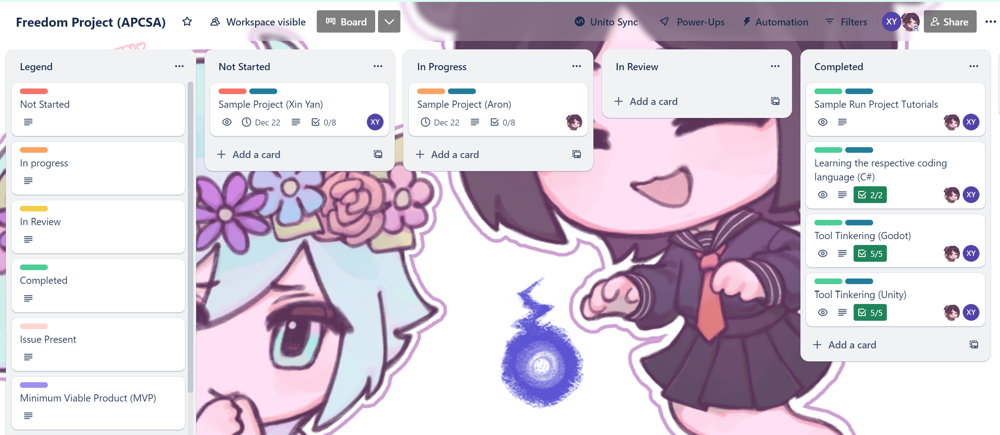
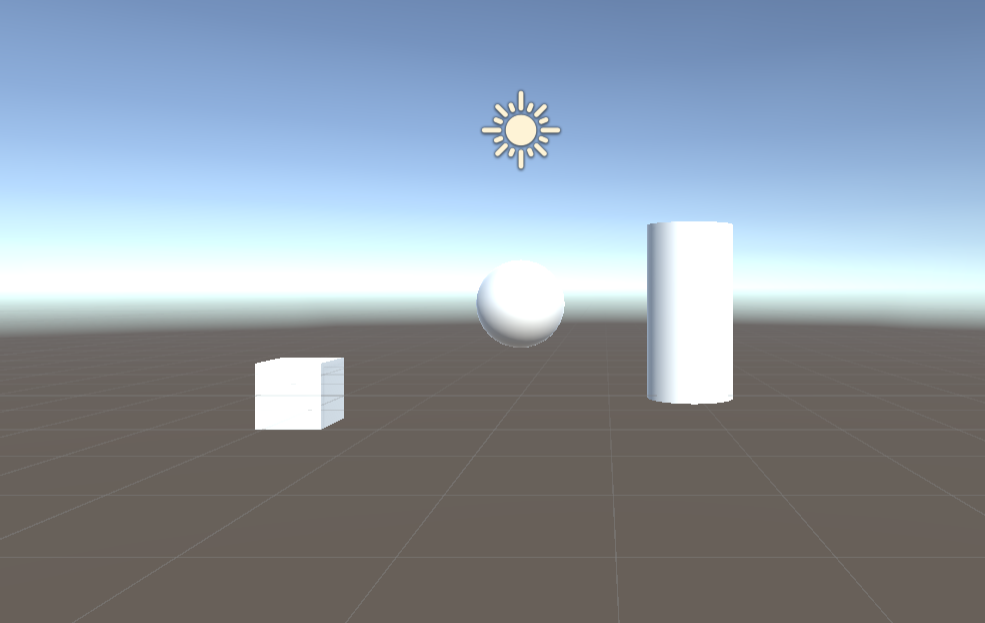
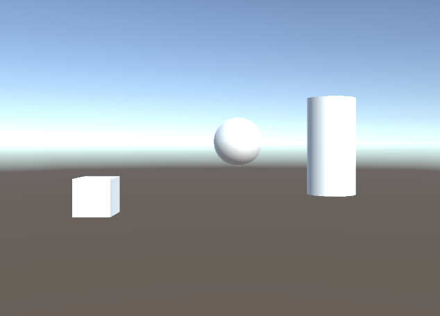

# Entry 1
##### 11/12/23

### Tool
I am currently in the APCSA (AP Computer Science A) class where I am learning about Java, a programming language. For this year's Freedom Project, I am allowed to use any tool to create any application. This is better than SEP11's Freedom Project because in SEP11, I am only allowed to use tools that are JavaScript specific.

I have been thinking of creating a shooting game for my Freedom Project. I got this inspiration from the memories that I've had with playing shooting games. I played a lot of Strike Force Heroes, Dead Zed, Dead Zed 2, and Strike of War in my younger years. I think it would be cool that I would create my own shooting game.

For this school year, I am working with [Aron](https://github.com/aronl9810) on this Freedom Project. I partnered up with Aron because he also had similar interests as me. My partner and I decided to work on building a First-Person Shooter (FPS) Player vs. Environment game. We had other ideas of what kind of shooting games we could make such as:
* Fast Pace First-Person Shooter Game
* Player vs Player (PVP) First-Person Shooter Game

Before searching for gaming engines that we might want to use, Aron introduced me to Trello, an application to be used for organization. He shared access to the APCSA [Trello board](https://trello.com/). My first impression of the Trello board was how organized it looked.

    

This is what our Trello board currently looks like.

There are several features to help us stay organized. One feature the board has is you can change the tags of the card to the status you are on. We have decided to learn [Unity](https://unity.com/), a game engine. Before this decision, we made a list of gaming engines we might want to learn for the rest of the school year. Here is the list:

1. [Unity](https://unity.com/)
2. [Godot](https://godotengine.org/)
3. [Cry Engine](https://www.cryengine.com/)
4. [Roblox](https://create.roblox.com/)
5. [Unreal Engine](https://www.unrealengine.com/en-US)

Unity was our top choice. I personally like Unity because of the sheer amount of [documentation](https://docs.unity.com/) and tutorials we can take advantage of. We definitely didn't want to use Unreal Engine for our project because we have to learn a harder programming language, C++. For Unity, we learn C# which is easier to learn than C++. We didn't have enough time to tinker with every tool. I have watched a [Roblox tutorial](https://www.youtube.com/watch?v=vCpl5M_9mcQ) before this school year. Roblox seems pretty easy to use. The interface was easy to use. I didn't tinker with Godot but, Aron did. He thought it was difficult to create and mutating the shapes. Unfortunately, I wasn't able to look at tutorials for Cry Engine as I had numerous assignments from other classes to do.

To start tinkering with Unity, I started creating a Unity account to tinker with the game engine. I had to verify if I was a student or not so I could get the student plan (the student plan is free and it gives you additional free resources). This for me was not as easy a task as my partner. We had to upload a document showing you are a current student. However, the document that I uploaded wasn't accepted. I tried to upload different documents two more times and I still wasn't verified. The verification machine didn't let me upload any more documents. I contacted the support team for this issue. Fortunately, they were able to verify my school status. Now, I can use the Unity Editor to tinker around. I installed Unity Hub and Unity Editor. This is what I created:

    

Result:

    

Creating shapes were pretty simple proving how easy Unity can be for first time users.

### Engineering Design Process (EDP)
Currently, I am in stages 1 and 2 of the **Engineering Design Process** which are to `define the problem` and `research the problem`. Although these stages aren't really relevant to what state of the Freedom Project I am in now, you could say that the stage, `define the problem` is defining which tool to use for this project, and `research the problem` is tinkering with the tool. In the next stage, `Brainstorm possible solutions`, my partner and I will be planning how the game should work and start building something relevant to the game.

### Skills
All of this progress is helping me improve my skills of *How to read* and *How to Google*. Since I am tinkering with Unity, I need to read documentation to help me acquire the necessary knowledge to build a game. In addition, figuring out which tool to use needs a Google search because I don't have a list of game engines on the back of my head. I need to research which game engine is going to be suitable for my partner and I. Improving on the skill of *How to Google* is going to help me find information more efficiently.

[Next](entry02.md)

[Home](../README.md)
