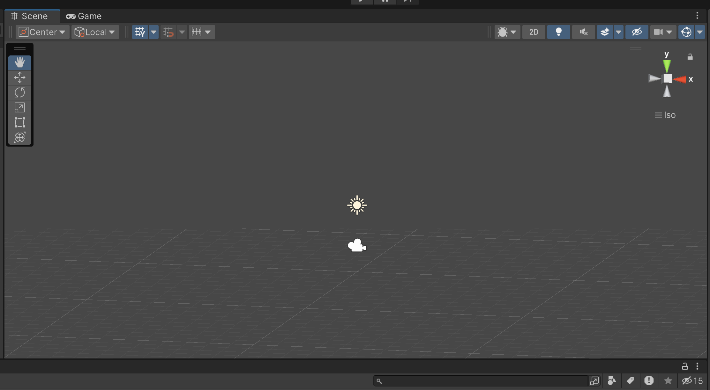

# Entry 2
##### 12/12/2023

After a few weeks after declaring which tool we would use for our Freedom Project, my partner and I decided that we should do our separate mini project before collaborating for the main project. By doing this, we are able to keep each other accountable.

For the mini project, Aron recommended me a [serious of tutorials](https://www.youtube.com/watch?v=rJqP5EesxLk&list=PLGUw8UNswJEOv8c5ZcoHarbON6mIEUFBC) on how to make a 3d shooter game. I gladly accepted this mini project idea because I thought this tutorial wouldn't be very difficult. Although the tutorial may take hours, the tutorial did provide us a lot of information to help us learn the tool. The original deadline for this mini project was the 22nd of December. However, Aron and I were very busy on other classes' homework so, we pushed back the deadline to the end of the winter break.

### Engineering Design Process (EDP)
Currently, I am in stage 2 of the **Engineering Design Process** which is to `research the problem`. Right now, my partner and I are learning our tool and making separate mini projects. After finishing up our project, we will be on stage 3 of the **EDP** which is to `brainstorm possible solutions` which is to planning to set up how our game is going to work.

### Skills
I have improved my skills in *How to learn* and *Attention to detail*. Right now, I am learning how to operate the Unity editor and I have to learn C# which Unity uses. I am taking extra time outside of school to make sure that I am familiar on how the editor works. When an error pops up, I have to fix it or else there is no result. By improving the skill, *Attention to detail*, I am being more careful on debugging the code. I make sure to follow every step of the tutorial.

[Previous](entry01.md) | [Next](entry03.md)

[Home](../README.md)