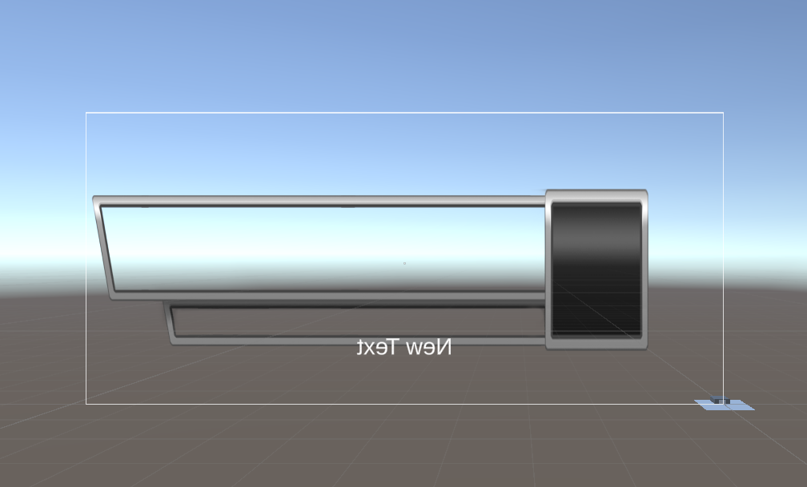

# Entry 3
##### 2/11/24
Aron created an interactable keypad and an animated door.

On my end, after the break, Aron and I were assigned tasks. Aron made a sketch of the map which he is currently making the map. In addition, he is also making the AI bots when the player attacks and the bots pursues the player for attacking it. For my roles, I am making the health bar and AI bot to patrol. I am using Natty GameDev's videos to help me achieve this goal.

I use Natty GameDev's resources to make a template of a healthbar. The files were zipped. After I extracted them all, I didn't know why I couldn't upload those assets as a package. I individually uploaded one asset at a time.

    

For the next break which is mid-winter recess, I am planning to finish up the health bar and AI patrol.

### Engineering Design Process (EDP)
Right now, Aron and I are currently in stage 3 of the **EDP** which is to `brainstorm possible solutions`. We have started our main project. Aron and I have separate roles for this project. I would say that we are in stage 4 of the Engineering Design Process (EDP) which is to `plan the most promising solution`.

### Skills

[Previous](entry02.md) | [Next](entry04.md)

[Home](../README.md)