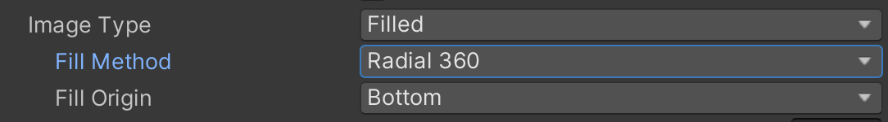
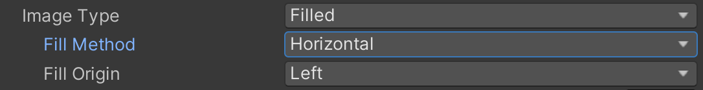

# Entry 4
##### 3/18/24

### Progress
Since the previous blog, I worked on making the health bar of the player. During the mid-winter recess break, I followed [Natty GameDev](https://www.youtube.com/@NattyGameDev)'s health bar tutorial. At first, a problem occured. My health bar was backwards in the scene. Here's what it looks like:

Fortunately, I didn't have to fix anything as when I played the scene, the health bar was placed correctly. Another issue came up. After completing the tutorial, I tried to run the scene which wasn't successful because of this:

Right now, the player's health alters by different keys. I made the `z` key to lose health and the `x` to heal the player. The image meant that the health bar wasn't attached to the player object. This means the health bar wouldn't be updated. I tried recreating the health bar to see if the error still exists and it did. After spending hours trying to figure out the solution, the error kept being displayed.

The solution to this error was in the player object's component.

The `Player Health` script was not added to the player object's component. Without this script, the player's health wouldn't change. Where you see `Front Health Bar` and `Back Health Bar` that are below the `Max Health` and `Chip Speed`, you are supposed to have their respective image for the health bar to operate.

After fixing this error, I had another error. The health bar worked but, the animation when the player gets shot or healed was strange. The health bar was changing in a circle. What I meant by that was when the player loses health, instead of the health being shortened to the left horizontally, the player's health decrease in the counterclock wise direction. After following the tutorial to see where the error was, I found this:

The `Fill Method` was `Radial 360` meaning the health bar functions like a circle. The solution was this:

Before I `git push` my changes, I ran the gameplay and the healthbar was working as intended. When I tried to `git push`, I had to `git pull` to accept the incoming changes that my partner made. The `git pull` turned into a merge conflict. I had to join a video chat for my partner to help me on that. After fixing the merge conflict, the health bar wasn't working properly. Eventually, the health bar was fixed on my end and I decided to `git push`. My partner wasn't able to operate the health bar though. Then, I had to resolve this issue resulting in hours being spent before the health bar was working properly on both ends.

### Engineering Design Process (EDP)

Right now, my partner and I are on **stage 5** of the EDP which is to *create a prototype*. In addition, we are still learning while we are creating our prototype. The next stage of the Engineering Design Process which to *test and evaluate the prototype* is still a long way for us. However, we are testing each component that we are making for this project.

### Skills

Skills-wise, I am improving on **communication** and **embracing failure**. My partner and I are communicating much better than the previous blog but, there is still room for improvement. As of now, I am creating the MVP of this project. In this process, there will be mistakes and I have to accept them. I shouldn't be discouraged by an error. Accepting failure helps me grow as a person and help me better understand the problems I am facing right now with what I am making.

[Previous](entry03.md) | [Next](entry05.md)

[Home](../README.md)