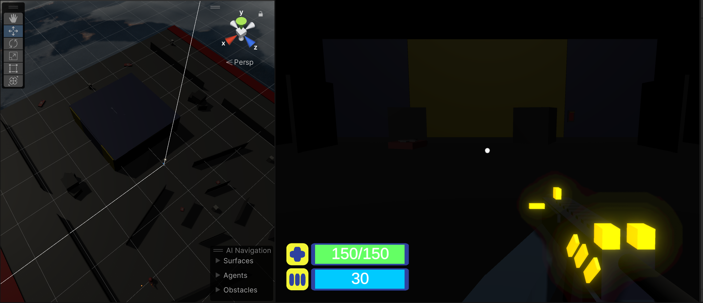
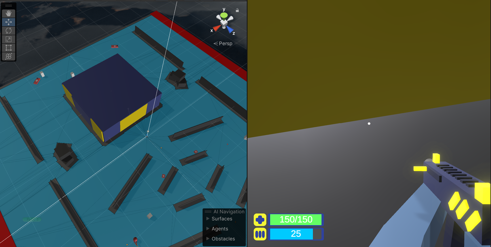

# Entry 5
##### 5/6/24

### Progress

#### Before

#### After

### Engineering Design Process (EDP)
Right now, my partner and I are on **stage5** of the EDP which is to *test and evaluate the prototype*. I also think that we are on **stage 6** of the EDP as well which is to *improve as needed*. My partner and I are still testing our creations to make sure there is no glitch. At this point, we are techincally beyond our MVP. Since we still have time for the Expo, I don't think we will be communicating our results any time soon.

### Skills

Skills-wise, I am improving on 

[Previous](entry04.md) | [Next](entry06.md)

[Home](../README.md)