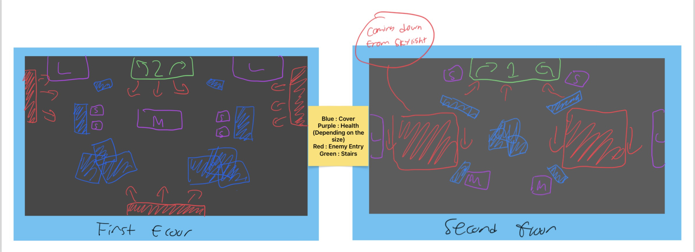
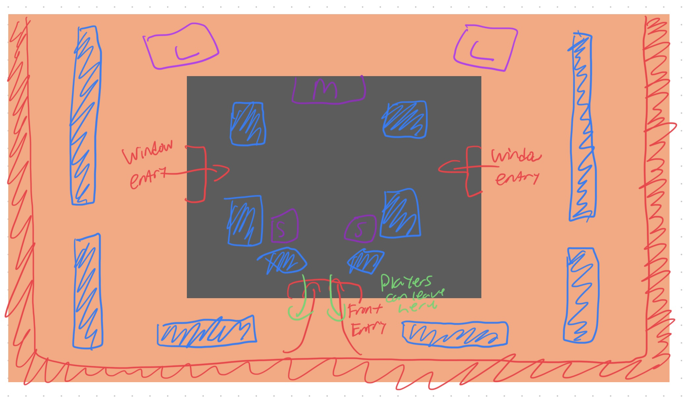
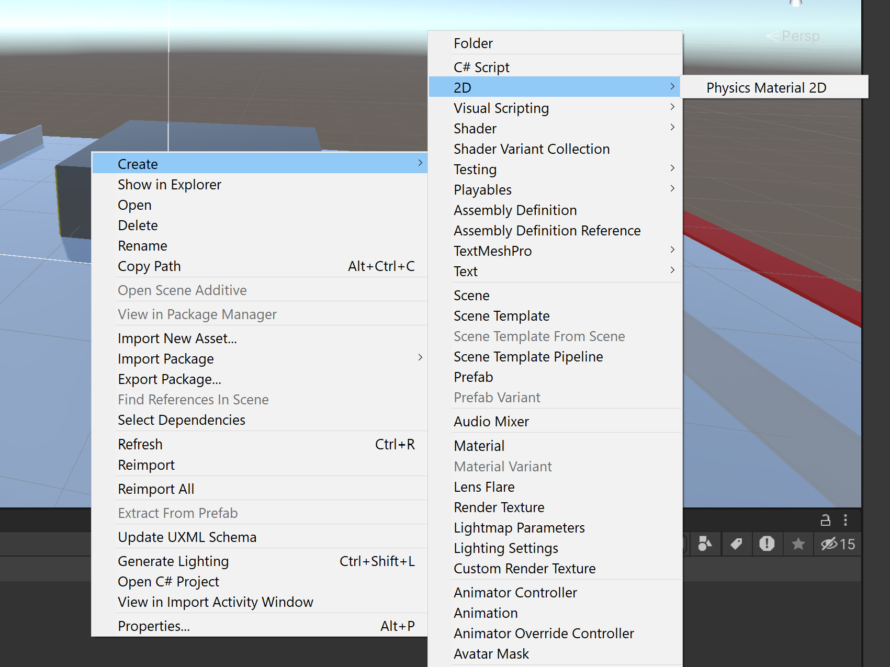
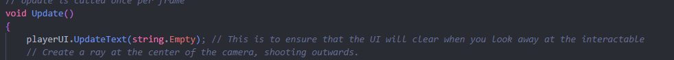

# Tool Learning Log

Tool: **Unity**

Project: **Player vs Environment First-Person Shooter Game**

---

10/23/23 - 10/29/23:

Links:
* [Unity](https://unity.com/)
* [The Unity Tutorial For Complete Beginners](https://www.youtube.com/watch?v=XtQMytORBmM)
* [Unity in 100 Seconds](https://www.youtube.com/watch?v=iqlH4okiQqg)
* [Official Unity Documentation](https://docs.unity3d.com/Manual/index.html)
* [CODING IN C# IN UNITY FOR BEGINNERS](https://unity.com/how-to/learning-c-sharp-unity-beginners)

Progress:
* made an account for Unity
* installed Unity
* watched videos about Unity
* looked at some documentation on the Unity website

What's next:
* waiting to be verified (apparently, my documents are expired which they shouldn't be)
* trying to get a license to use the Unity editor
* start tinkering with the editor

10/30/23 - 11/12/23:

Links:
* [C# Tutorial - Full Course for Beginners from freeCodeCamp](https://www.youtube.com/watch?v=GhQdlIFylQ8)
* [Learn C# BASICS in 10 MINUTES!](https://www.com/watch?v=IFayQioG71A)
* [Learn about FPS Microgame](https://learn.unity.com/project/fps-template)

Progress:
* I have been verified after contacting the support team
* I am approved for the Unity Student license
* created a Unity project called `Sandbox` for tinkering with the tool
* created shapes on `Sandbox`
* changing the shapes' dimension

11/13/23 - 11/26/23:

Links:
* [#1 FPS Movement: Let's Make a First Person Game in Unity!](https://www.youtube.com/watch?v=rJqP5EesxLk&list=PLGUw8UNswJEOv8c5ZcoHarbON6mIEUFBC&index=2)

Progress:
* Watching this [video](https://www.youtube.com/watch?v=rJqP5EesxLk&list=PLGUw8UNswJEOv8c5ZcoHarbON6mIEUFBC&index=2) (this video is for game's graphics that are more cartoonish)
* Applying the knowledge I obtained from the video to the Unity Editor
What's next:
* Watching this [video](https://www.youtube.com/watch?v=swOfmyJvb98&list=PLtLToKUhgzwm1rZnTeWSRAyx9tl8VbGUE) (this video is for more realistic graphics)

12/11/23

I have finished watching and following [#1 FPS Movement: Let's Make a First Person Game in Unity!
](https://www.youtube.com/watch?v=rJqP5EesxLk&list=PLGUw8UNswJEOv8c5ZcoHarbON6mIEUFBC&index=2) and [#2 FPS Raycast Interactions: Let's Make a First-Person Game in Unity!](https://www.youtube.com/watch?v=gPPGnpV1Y1c&list=PLGUw8UNswJEOv8c5ZcoHarbON6mIEUFBC&index=2). I solved my problem with the 2D Vector Composite by the help of this [link](https://forum.unity.com/threads/no-option-of-2d-vector-composite-in-input-system-1-0-0.888607/) that I found. The second half of the second video doesn't make sense to me.

I had a problem with seeing the objects in the scene section. I could only see the directional light. When I click on an object, I would only see the frame of the object. On 12/11/2023, Aron found out that my shading mode was wireframe not shaded.


What's next:

I am going to watch and follow [#2.5 Interaction Events! :Let's Make a First Person Game in Unity!](https://www.youtube.com/watch?v=_UIiwzfZoZA&list=PLGUw8UNswJEOv8c5ZcoHarbON6mIEUFBC&index=3).

12/18/23

I did not finish completing the tutorial but, I am at `3:52`. I am having trouble with compiling my C# scripts. Without compiling correctly, I won't be able to move my object or make the object interact with other objects. I need to fix this compiling error. I learned how to assign color to an object.

What's next:

I am going to complete [this tutorial](https://www.youtube.com/watch?v=_UIiwzfZoZA&list=PLGUw8UNswJEOv8c5ZcoHarbON6mIEUFBC&index=3). I am also going to watch the [How to make a Better Health Bar in Unity : Chip Away Tutorial](https://www.youtube.com/watch?v=CFASjEuhyf4&list=PLGUw8UNswJEOv8c5ZcoHarbON6mIEUFBC&index=4) video.

12/25/23

I finished watching and following [#2.5 Interaction Events! :Let's Make a First Person Game in Unity!](https://www.youtube.com/watch?v=_UIiwzfZoZA&list=PLGUw8UNswJEOv8c5ZcoHarbON6mIEUFBC&index=3)

1/8/24

I am trying to solve the problems I am facing with the C# scripts. I can't add the scripts to the component of an object. The scripts aren't compiling. I searched online about this problem.

1/15/24

Aron set up the main project repo. I am installing wsl to my computer. I ran into problems and hopefully, I will get to finish the setup.

1/22/24

I finished set up. I am now learning more about the Unity Editor through the [Unity website](https://learn.unity.com/). I am currently learning about [creating UI buttons](https://learn.unity.com/tutorial/creating-ui-buttons).

1/29/24

Aron and I started doing our roles for the game. I am making the health bar for the characters and AI patrolling (NPC character just walking around). Aron sketched two designs of a possible environment that we will use for our game. I chose this one:


This was the other design that Aron sketched:


2/5/24

I am continuing to do my roles for this project. I did watch some parts of the [health bar](https://www.youtube.com/watch?v=CFASjEuhyf4&list=PLGUw8UNswJEOv8c5ZcoHarbON6mIEUFBC&index=4) and [AI patrolling](https://www.youtube.com/watch?v=Mp8yFUKxldk&list=PLGUw8UNswJEOv8c5ZcoHarbON6mIEUFBC&index=6).

2/12/24

I am still working on making the health bar and doing the AI patrol.

3/3/24

I created the healthbar, but there were issues. One of the issues was this: <p align="center"></p>

This meant that an object was not attached to another object to make the healthbar work.

How I solved it:
* changed the class name to PlayerHealth in the PlayerHealth C# script
* attach the PlayerHealth script to the Player object (forgot to do so)
* attach the FrontHealthBar image to FrontHealthBar (object)
* attach the BackHealthBar image to BackHealthBar (object)
* the fill method of FrontHealthBar and BackHealthBar set to horizontal (it was 360 dial before)

I fixed the healthbar before finding out that the healthbar changed in a circle.

3/11/24

My next component that I need to make is the ammunition system. It helps keep track of how much ammo you have left per magazine and how much ammo is left in total.

Right now, I am exploring different tutorials on how to create the ammo system. Here are the tutorials that I found:
* [Ammo & Reloading - Unity Tutorial](https://www.youtube.com/watch?v=kAx5g9V5bcM)
* [Easy Ammo & Reloading System in Unity](https://www.youtube.com/watch?v=cjNMQkODh1M)
* [Making RELOADING and an AMMO SYSTEM! (Unity Multiplayer FPS Tutorial E06)](https://www.youtube.com/watch?v=PqbS46fWqbM)
    * this is part of a serious of tutorials

After skimming through these videos, the first and third video gives me more information than the second video. The second video is more for simple shooting games. I will be looking forward to the first and third videos to help me create this component.

3/18/24

After careful consideration, I decided to use [Ammo & Reloading - Unity Tutorial](https://www.youtube.com/watch?v=kAx5g9V5bcM) and [Making RELOADING and an AMMO SYSTEM! (Unity Multiplayer FPS Tutorial E06)](https://www.youtube.com/watch?v=PqbS46fWqbM) to help me make the ammo system.

Reasons:
* the first video helps you with reloading
* the third video helps you with the ammo system (simple to follow)
* both videos are more simple and easier to follow

For the AI patrol, I am finshing up the intro of the Natty GameDev's [tutorial](https://www.youtube.com/watch?v=Mp8yFUKxldk&list=PLGUw8UNswJEOv8c5ZcoHarbON6mIEUFBC&index=7).


3/25/2024

We have a problem. The health bar that I created only works on free aspect screen size. It doesn't work for other screen size or resolution. Aron recommended [this video](https://www.youtube.com/watch?v=0tDPxNB2JNs&t=48s) to help me create a working health bar. While the health bar I created has animations when the player takes damage or gets healed, the new health bar will be a simple one. I followed all of the steps except creating the sprites. I am not sure on how to creat a sprite. You can turn an image to a sprite. I looked at the comments and found this:
```
It's possibly that I missed something but when I click on source image to select a Sprite, I can't find square. Do I need to download it from somewhere? // original commenter

You can either import your own, or if it is missing from Unity you may need to install the 2D package from the package manager // creator of the video

i can't find it either, u can right click in the project window, Create => 2D => Sprites => Square. Then drag the square sprite u just created into the source image spot and it should work just fine // another commenter
```
I followed the commenter's suggestion but, I can't find the Sprites after hovering over 2D.
<p align="center">

</p>

4/1/24

I completed the tutorial except the part where if the `healthAmount` is less than or equal to 0. Now, the health bar updates (takes damage or heals).  When the player reaches less than or equal to 0, I want the player to be reloaded. The code that the YouTuber wrote for that part is this: `Application.LoadLevel(Application.loadedLevel);`. However, the Unity Editor recognizes this line as an error. Another problem came up, when I tried to test my health bar, the gameplay freezes. The problem was this:

<p align="center">

</p>

I contacted Aron about this and he also has the same problem. We used Discord to chat about this problem. Compared to the previous sample scene, there was no issue about this. Aron changed the current sample scene back to the old one. I redid the health bar and it now works on my end. I `git push` the progress. However, Aron didn't have the same hierarchy as mine. I forgot to `git push` the sample scene. I keep forgetting to do that. I need to break out of this habit. As of right now, we don't have a problem with the health bar.

4/8/24

I started my other task: making the AI patrol state. I am watching [#4 Game AI - Patrolling : Let's Make a First Person Game in Unity!](https://www.youtube.com/watch?v=Mp8yFUKxldk&list=PLGUw8UNswJEOv8c5ZcoHarbON6mIEUFBC&index=6) right now. Aron redesigned the health bar. The health bar now looks more like a game health bar. My health bar was very simple; black border with the green and red background to update the player's health.

4/15/24

I made some progress with the AI patrol state. I made an enemy but, it is without color. I made progress on the BaseState.C# and StateMachine.C# scripts that I need to write. I am having trouble with making spheres for the eyes of the enemy. My spheres are elongated.


The Spring Break

This whole time, I wasn't able to go into 3d perspective. You just have to hold the right side of the mouse and move around. I finished making one patroling enemy. I worked on making the main menu of the game. I worked on the pause menu but I am not sure if we need it. I still have to fix the mistakes from the main menu.

4/29/24

I made several enemies. I had a merge conflict and that took a while to fix.

4/30/24

The problem that I had with the main menu was when you click play the game scene was dark. You can barely see anything. I found this [video](https://www.youtube.com/watch?v=8-oXE2NWSLM) to help out with this problem. You just have to generate lighting. A folder with the lighting details will be generated for you. Today, I also broke the bullets script. I made the bullets stay forever and not disappear. Thankfully, Aron fixed the problem because I would have made the problem more worse.

---
<!--
* Links you used today (websites, videos, etc)
* Things you tried, progress you made, etc
* Challenges, a-ha moments, etc
* Questions you still have
* What you're going to try next
-->
